# Pós-Tech-FIAP/ALURA-Hackaton

# Descrição do projeto
Desenvolver um sistema eficiente para o processamento de pagamentos de operadoras de cartão de crédito. Nosso objetivo principal é receber os dados das transações com cartão de crédito e validar se o cartão do cliente possui limite disponível para a realização da compra. Este sistema garantirá a verificação precisa e em tempo real do limite de crédito dos clientes,proporcionando uma experiência de pagamento segura e confiável.

## Requisitos:
1. Microsserviço de usuários: microsserviço responsável por autenticar um usuário e fornecer um token de acesso, para realizar a comunicação com demais microsserviços. O token deverá ter validade de 2 minutos. 
2. Microsserviço de clientes: microsserviço que permitirá o cadastro do cliente.
3. Microsserviço de cartões de crédito: microsserviço que permitirá o cadastro de cartão de crédito.
4. Microsserviço de registro e consulta de pagamentos: microsserviço que permitirá o cadastro de um pagamento com cartão de crédito, bem como a consulta de pagamentos realizados.

## Entregáveis:
1. Link do Github com o código fonte dos serviços desenvolvidos.
2. Documentação técnica.
3. Um relatório técnico descrevendo as tecnologias e ferramentas utilizadas, os desafios encontrados durante o desenvolvimento e as soluções implementadas para resolvê-las.

# Tecnologias utilizadas
1. Java 17
2. Gradle 7.6
3. Spring Boot 3.3.2
4. Spring Web MVC (compatível com o Spring Boot) 
5. Spring Data JPA (compatível com o Spring Boot)  
6. Spring Bean Validation (compatível com o Spring Boot) 
7. Spring Doc Open API 2.3.0
8. Spring Open Feign 4.1.1
9. Lombok 
10. Postgres 16.3
11. Flyway 
12. JUnit 5
13. Mockito
14. TestContainers
15. Docker
16. WireMock 3.3.1

# Setup do Projeto

Para realizar o setup do projeto é necessário possuir o Java 17, Gradle 7.6, docker 24 e docker-compose 1.29 instalado em sua máquina.
Faca o download do projeto (https://github.com/EvolutionTeamFiapAluraPostech/hackaton-2ADJT) e atualize suas dependências com o gradle.
Antes de iniciar o projeto é necessário criar o banco de dados. O banco de dados está programado para ser criado em um container. 
Para criar o container, execute o docker-compose (Acesse a pasta raiz do projeto, no mesmo local onde encontra-se o arquivo compose.yaml). Para executá-lo, execute o comando docker-compose up -d (para rodar detached e não prender o terminal). O docker compose irá criar os bancos de dados, buildar a imagem de cada um dos microsserviços, iniciar a aplicação dentro do container correspondente (em sua porta específica). Desta maneira, o conjunto todo da solução estará disponível para ser consumido.
Após a inicialização dos microsserviços, será necessário se autenticar, pois o Spring Security está habilitado. Para tanto, utilize o Postman (ou outra aplicação de sua preferência), crie um endpoint para realizar a autenticação, com a seguinte url **localhost:8080/api/autenticacao**. No body, inclua um json contendo o atributo “usuario” com o valor “adj2” e outro atributo “senha” com o valor “adj@1234”. Realize a requisição para este endpoint para autenticar o usuário e obter o JWT token de acesso que deverá ser utilizado para consumir os demais endpoints do projeto.
Segue abaixo instruções do endpoint para se autenticar na aplicação.

- POST /api/autenticacao HTTP/1.1
- Host: localhost:8080
- Content-Type: application/json
- Content-Length: 76

# Collection do Postman
* 
* Esta collection está salva na raiz do projeto.

# Environments do Postman
* 
* Estas environments estão salvas na raiz do projeto.

# Documentação da API
* Local dev
  * Microsserviço de usuários - http://localhost:8080/swagger-ui/index.html
  * Microsserviço de clientes - http://localhost:8081/swagger-ui/index.html
  * Microsserviço de cartões de crédito - http://localhost:8082/swagger-ui/index.html
  * Microsserviço de registro e consulta de pagamentos - http://localhost:8083/swagger-ui/index.html

# Documentação do PROJETO
O projeto está dividido em 4 containers de microsserviços backend Java Spring Boot e outros 4 containers de banco de dados Postgresql. Cada um dos microsserviços possui seu respectivo banco de dados.

O backend foi implementado seguindo as recomendações da Clean Architecture, com Clean Code, princípios SOLID/YAGNI/KISS e testes automatizados (de unidade e integração), seguindo os princípios do FIRST e Clean Tests. 

# Comunicação entre os microsserviços

- O microsserviço de usuários se comunica com todos os demais microsserviços, através da interface da aplicação*, pois este gerencia os usuários e a autenticação através de um token JWT.
- o microsserviço de clientes se comunica com a interface da aplicação*.
- O microsserviço de cartões de crédito se comunica com o microserviço de clientes e com a interface da aplicação*.
- O microsserviço de pagamentos se comunica com os microsserviços de clientes e cartões de crédito e com a interface da aplicação*.
- Observações: 
  - os containers com banco de dados estão acessíveis apenas por seu respectivo microsserviço.
  - neste projeto, a **interface da aplicação** é o Postman.

# Microsserviço de usuários - API
O objetivo deste microsserviço é realizar a autenticação do usuário e fornecer um JWT token de acesso. O cadastro do usuário será realizado via flyway migration, inserindo o usuário sugerido pelos professores.
* http://localhost:8080/api/autenticacao
    * Verbo POST - para realizar a autenticação do usuário já cadastrado.
        * Escopo: público, não requer autenticação.
        * Contrato:

            

        * Retorno:

            

        * Regras de negócio:
            * Atributos usuario e senha obrigatórios;
            * Atributo senha com o tamanho mínimo de 8 e máximo de 20 caracteres;
            * Validação de força da senha, exigindo no mínimo, 1 caracter minúsculo, 1 caracter especial ( @#$%^&+= ) e 1 número;
            * Validação do usuário já cadastrado na base de dados;
        * Http response status do endpoint:
            * Status 200 - Ok - usuário autenticado na aplicação;
            * Status 401 - Unauthorized - se o usuário não foi autenticado;
            * Status 500 - para um erro de negócio.

    * Documentação da API: http://localhost:8080/swagger-ui/index.html
    * Banco de dados: http://localhost:5432/users-db

# Microsserviço de usuários - Clean Architecture e Entity Diagram

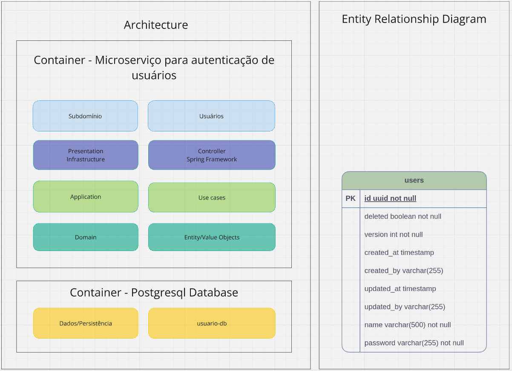

# Microsserviço de usuários - Resultado dos testes

31 testes de integração e unidade, executados em 2 segudos, com 100% de classes e 84% de linhas de código cobertas.

# Microsserviço de clientes - API
O objetivo deste microsserviço é realizar o registro de um cliente. 
* http://localhost:8081/api/cliente
    * Verbo POST - para realizar o cadastro do cliente.
        * Escopo: privado, requer autenticação.

        * Contrato:

            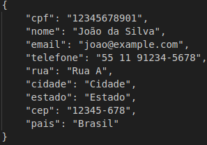

        * Retorno:

            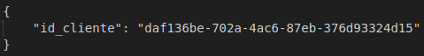

        * Regras de negócio:
            * Atributos cpf, nome, email e telefone obrigatórios;
            * Atributo nome com o tamanho mínimo de 2 e máximo de 500 caracteres;
            * Validação do número do cpf;
            * Cpf já existente na base não pode ser novamente salvo;
            * Validação de máscara de email;
            * email já existente na base não pode ser novamente salvo;
        * Http response status do endpoint:
            * Status 200 - Ok - cliente cadastrado com sucesso;
            * Status 401 - Unauthorized - se o usuário não foi autenticado;
            * Status 500 - para um erro de negócio.
* http://localhost:8081/api/cliente/{cpf}
    * Verbo GET - para realizar a pesquisa de um cliente por seu cpf. Será utilizado na validação do cliente no microserviço de registro de cartão de crédito.
        * Escopo: privado, requer autenticação.
        * Retorno:

            

        * Regras de negócio:
            * O parâmetro CPF é obrigatório e válido.
        * Http response status do endpoint:
            * Status 200 - Ok - cliente encontrado;
            * Status 401 - Unauthorized - se o usuário não foi autenticado;
            * Status 500 - para um erro de negócio.

    * Documentação da API: http://localhost:8081/swagger-ui/index.html
    * Banco de dados: http://localhost:5433/customers-db

# Microsserviço de clientes - Clean Architecture e Entity Diagram

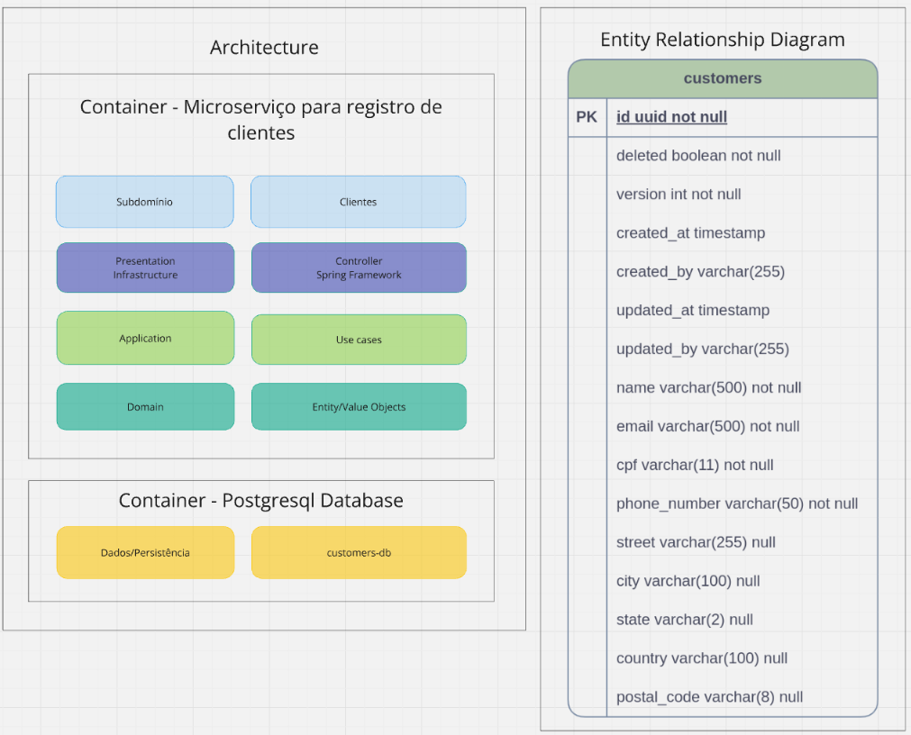

Foi utilizado no projeto o flyway para criar a tabela de banco de dados e realizar a inclusão de um cliente inicial, para facilitar testes automatizados e manuais.
- id: dcd3398e-4988-4fba-b8c0-a649ae1ff677
- cpf: 84527263846

# Microsserviço de clientes - Resultado dos testes

169 testes de integração e unidade, executados em 2 segudos, com 100% de classes e 91% de linhas de código cobertas.

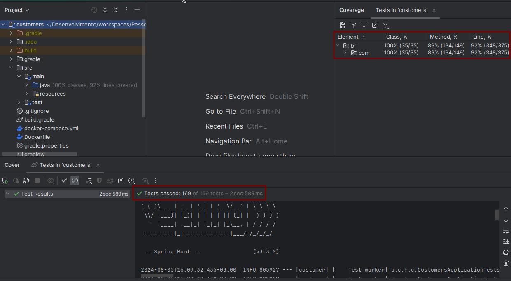

# Microsserviço de cartões de crédito - API
O objetivo deste microsserviço é realizar o registro de cartões de crédito de um cliente. 
* http://localhost:8082/api/cartao
    * Verbo POST - para realizar o cadastro do cartão de crédito do cliente.
        * Escopo: privado, requer autenticação.
        * Contrato:

            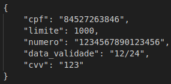

        * Retorno:

            http status: 200 para cartão de crédito cadastrado com sucesso.

        * Regras de negócio:
            * Atributos cpf, limite, número do cartão, data de validade e cvv obrigatórios;
            * Validação do número do cpf existente no microsserviço de clientes;
            * O valor do limite deve ser maior ou igual a zero.
            * O número do cartão deve ter 16 dígitos.
            * O número do cartão deve ser único.
            * É permitido apenas dois cartões por cpf.
        * Http response status do endpoint:
            * Status 200 - Ok - cliente cadastrado com sucesso;
            * Status 401 - Unauthorized - se o usuário não foi autenticado;
            * Status 403 - para o número máximo de cartão atingido por cliente;
            * Status 500 - para um erro de negócio.

* http://localhost:8082/api/cartao/{numero}/cliente/{cpf}
    * Verbo GET - para realizar a pesquisa de um cartão pelo número e pelo cpf do cliente. Será utilizado na validação do cartão pertencente ao cliente e o limite disponível no microserviço de registro de pagamentos.
        * Escopo: privado, requer autenticação.
        * Retorno:

            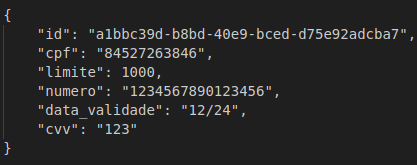

        * Regras de negócio:
            * Os parâmetros número do cartão e cpf são obrigatórios.
        * Http response status do endpoint:
            * Status 200 - Ok - cartão de crédito encontrado;
            * Status 401 - Unauthorized - se o usuário não foi autenticado;
            * Status 500 - para um erro de negócio.

    * Documentação da API: http://localhost:8082/swagger-ui/index.html
    * Banco de dados: http://localhost:5434/creditcard-db

# Microsserviço de cartões de crédito - Clean Architecture e Entity Diagram

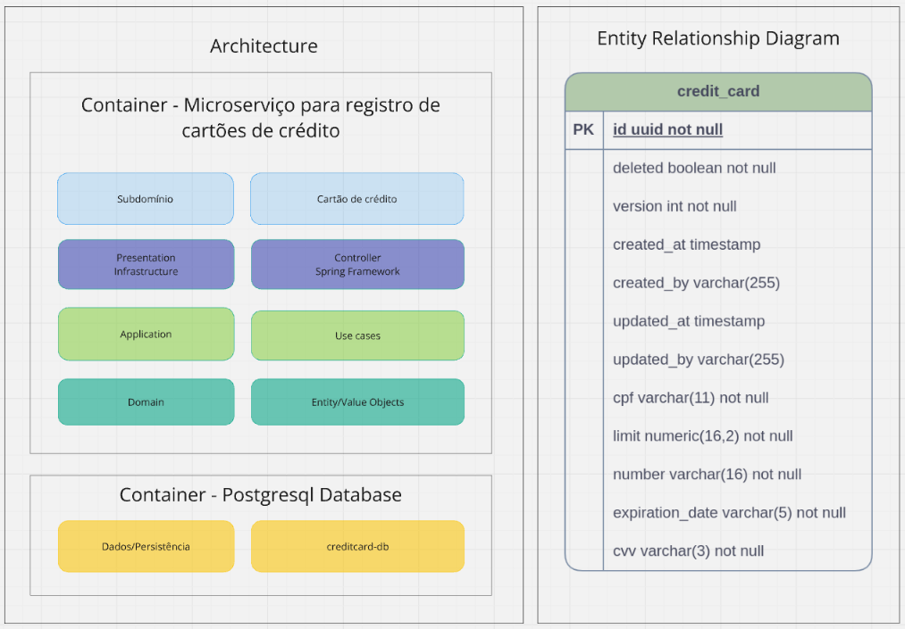

Foi utilizado no projeto o flyway para criar a tabela de banco de dados e realizar a inclusão de um cartão de crédito inicial, vinculado ao cliente cadastrado no microsserviço de clientes, para facilitar testes automatizados e manuais.
- id: fc9ca35f-e911-4bdd-9b73-a6ddc622d0fd
- número: 1234567890123456
- cpf: 84527263846

# Microsserviço de cartões de crédito - Resultado dos testes

160 testes de integração e unidade, executados em 2 segudos, com 100% de classes e 92% de linhas de código cobertas.

O microsserviço de cartões de crédito realiza uma comunicação com o microsserviço de clientes, para verificar se o CPF existe. Esta comunicação poderia influenciar nos testes de integração, pois este realiza um teste iniciando do endpoint, passando pelas camadas internas da aplicação, realiza uma operação no banco de dados e por fim faz todo o caminho de volta, retornando o resultado do consumo do endpoint. Para que o teste seja independente do microsserviço de clientes, foi utilizado o WireMock no teste de integração para simular o microsserviço de clientes, sem que este esteja ativo.

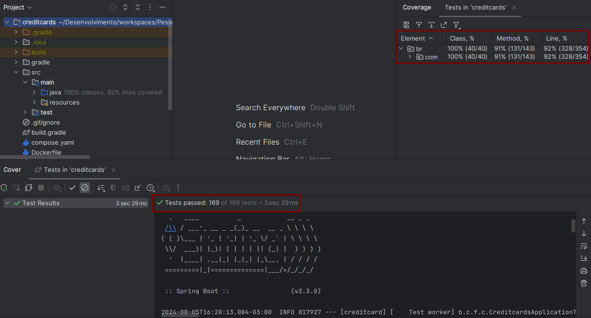

# Microsserviço de registro de pagamentos - API
O objetivo deste microsserviço é realizar o registro de pagamentos de compras realizadas pelo cliente. 
* http://localhost:8083/api/pagamentos
    * Verbo POST - para realizar o cadastro do pagamento da compra realizada pelo cliente.
        * Escopo: privado, requer autenticação.
        * Contrato:

        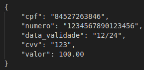

        * Retorno:

        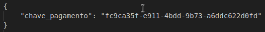

        * Regras de negócio:
            * Atributos cpf, número do cartão, data de validade, cvv e valor obrigatórios;
            * Validação do cpf e número do cartão existente no microsserviço de clientes;
            * Validação da validade do cartão;
            * Validação do cvv do cartão;
            * Validação do valor maior que zero;
            * Validação do valor do pagamento esteja dentro do saldo do limite do cartão de crédito;
            * Solicitar ao microsserviço de cartão de crédito a atualização do saldo do limite do cliente;
        * Http response status do endpoint:
            * Status: 200 para pagamento realizado com sucesso;
            * Status: 401 para erro de autorização;
            * Status: 402 para caso o limite do cartão foi superado;
            * Status: 500 para um erro de negócio.

* http://localhost:8083/api/pagamentos/cliente/{chave}
    * Verbo GET - para realizar a pesquisa de pagamentos pelo ID do cliente. 
        * Escopo: privado, requer autenticação.
        * Retorno:

        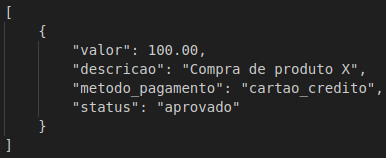

        * Regras de negócio:
            * O parâmetro ID do cliente é obrigatório.
        * Http response status do endpoint:
            * Status 200 - Ok - lista de pagamentos encontrada;
            * Status 401 - Unauthorized - se o usuário não foi autenticado;
            * Status 500 - para um erro de negócio.

    * Documentação da API: http://localhost:8083/swagger-ui/index.html
    * Banco de dados: http://localhost:5435/payments-db

# Microsserviço de registro de pagamentos - Clean Architecture e Entity Diagram

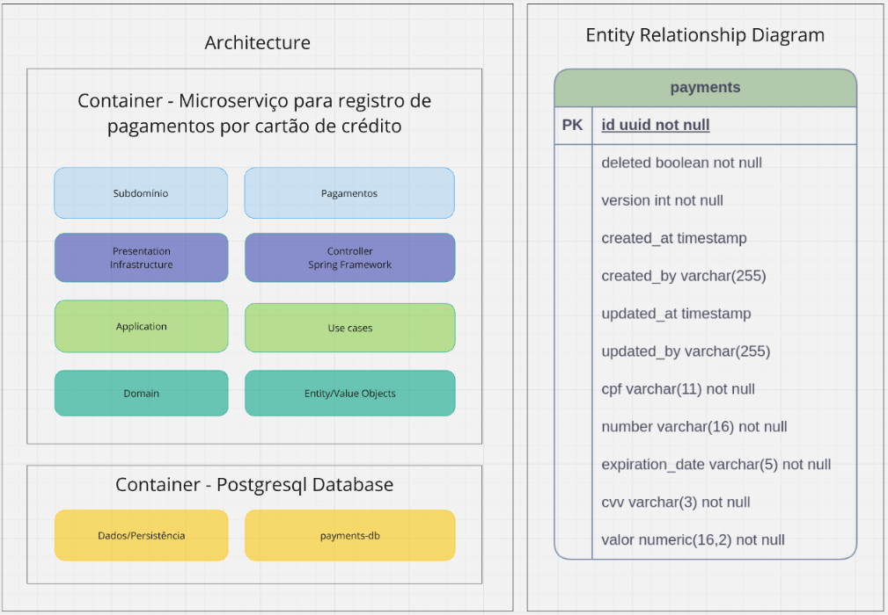

Foi utilizado no projeto o flyway para criar a tabela de banco de dados.

# Microsserviço de registro de pagamentos - Resultado dos testes

135 testes de integração e unidade, executados em 2 segudos, com 100% de classes e 91% de linhas de código cobertas.

O microsserviço de pagamentos realiza uma comunicação com o microsserviço de clientes e o microsserviço de cartões de crédito, para verificar se o cartão de crédito/CPF existe. Esta comunicação poderia influenciar nos testes de integração, pois este realiza um teste iniciando do endpoint, passando pelas camadas internas da aplicação, realiza uma operação no banco de dados e por fim faz todo o caminho de volta, retornando o resultado do consumo do endpoint. Para que o teste seja independente do microsserviço de clientes e de cartões de crédito, foi utilizado o WireMock no teste de integração para simular o microsserviço de clientes, sem que este esteja ativo.

# Clean Architecture

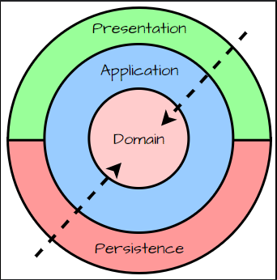

As aplicações desenvolvidas neste projeto utilizam a Clean Architecture, onde as regras de negócio concentram-se no centro da "cebola" (como mostra a imagem acima denominada *Domain*), totalmente independentes de bibliotecas ligadas a infraestrutura. 
Na camada *Domain* estão contidas classes do tipo Entity, Value Objects, Exceptions lançadas por regras de negócio e outras classes auxiliares vinculadas ao negócio.
Na camada *Application* estão contidas as abstrações (interfaces) que conhecem e se relacionam com classes da camada *Domain*.
Na camada *Presentation* temos as implementações das interfaces encontradas na camada *Application*. Aqui estão as classes do Spring Framework que entregam ao desenvolvedor classes com comportamentos para interagir com a *Infraestrutura*.
Observe que as classes contidas na camada *Presentation* não conhecem as classes contidas na camada *Domain*, tornando-as desacopladas do conhecimento de regras de negócio.

# Qualidade de software
Para garantir a qualidade de software, foram implementados testes de unidade e de integração na grande maioria do código e teste de design arquitetural do projeto com o ArchUnit. Para identificar o que foi testado, utilizamos a cobertura de testes de código do próprio IntelliJ IDEA e o ArchUnit. O ArchUnit foi utilizado para identificar através de um teste a existência de testes correspondentes para as classes de serviço, use case, validators, identifica se as classes foram criadas respeitando a arquitetura/design do projeto (cada classe deverá ser criada em sua respectiva pasta, conforme seu objetivo, não é permitido injetar repositories em classes indevidas, métodos de use case que executam operações de escrita em banco de dados devem ser anotadas com @Transactional).
Os testes de unidade foram implementados nas classes de domínio e application testando a menor unidade de código. Os testes de integração foram implementados nas classes de presentation, realizando a requisição HTTP aos endpoints em diversos cenários, testando o código por completo, da entrada dos dados, processamento e saída. O objetivo desta segregação foi considerar a eficiência dos testes versus o tempo de entrega do projeto. Aplicando este método, foi apurado pela cobertuda de testes do IntelliJ IDEA, em mais de 90% de classes testadas na maioria dos microserviços. O grande número de testes é justificado pela arquitetura do projeto, onde está sendo implementada a Clean Archtecture, com a utilização de entidades/value objects e o princípio SOLID, YAGNI e KISS. Para realizar o teste de cobertura, clique com o botão direito do mouse sobre o nome do projeto, navegue até a opção More Run/Debug, em seguida selecione a opção Run tests in <nome do projeto> with Coverage.
As comunicações dentre microsserviços foram mockadas nos testes de integração, com a utilização do WireMock, para que os testes se mantenham independentes, porém contemplando os cenários pertinentes a esta comunicação e considerando o princípio de testes FIRST.

